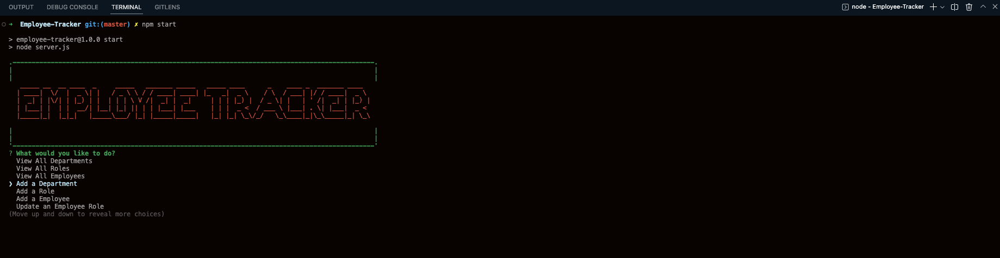

# Employee-Tracker


## Description

This application is a content management systems (CMS). A command-line application to manage a company's employee database, using Node.js, Inquirer, and MySQL.

## Output:

### Terminal Start Screen



## Table of Contents

- [Installation](#installation)
- [Usage](#usage)
- [Links](#links)
- [License](#license)
- [Contributing](#contributing)
- [Tests](#tests)
- [Questions](#questions)

## Installation

Below is the instruction for installation of this project.

- Download or Clone this project from the repository from GitHub repository link provided in the links section below. After downloaded make sure to have mysql server is downloaded and running in your system (PC/Laptop).
- Then project open it on VS Code editor and open server.js file in integrated Terminal. Then run `npm i` or `npm install` in order to download all the dependencies.

After downloading the dependencies. Follow the MySQL instructions to create your tables.

- Enter `mysql -u root -p` in the CLI to enter mysql.
- Enter your mysql password (it is the same as the one in the db/connection.js file).
- Create your database by entering `CREATE DATABASE employees;` and enter.
- Make sure it was created successfully by entering `SHOW databases;`.
- Tell your database to use the employees database by entering `USE employees;`.
- Tell your database to use your db and schema files by entering `source db/db.sql;` and enter, then type `source db/schema.sql;` and enter.
- Exit MySQL by entering `quit;`.
- Your are done!

## Usage

To run the application, Run `node server.js` or `npm start` in your terminal to launch the application.

### The following animation demonstrates the application functionality

#


#

## Links

Below is the link related to the Project:

- GitHub repository - [Click Here](https://github.com/rochak-ms/Employee-Tracker.git)
- Project walk-through video - [Click Here](https://drive.google.com/file/d/1u2dvDgvV47XMP6SjaK7sQRbCuvcWhyg2/view?usp=share_link)

## License


Please visit [Here](https://mit-license.org/) for detail information.

## Contributing

Please contribute to this project. Submit a bugs and feature request in issues section of the project repository in GitHub.

## Tests

```
none
```

## Questions

If you have any questions about the project, please contact me at rochak.ms@gmail.com. Or you can find me [Here](https://github.com/rochak-ms) on GitHub.
